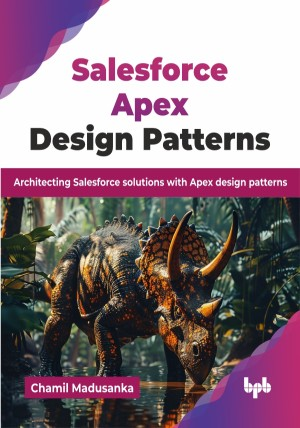

# Salesforce Apex Design Patterns

Architecting Salesforce solutions with Apex design patterns.

This is the repository for [Salesforce Apex Design Patterns
](https://bpbonline.com/products/salesforce-apex-design-patterns?variant=44642865512648),published by BPB Publications.

## About the Book
Salesforce Apex is a powerful programming language that drives customization and automation on the Salesforce platform. However, writing scalable and maintainable Apex code requires a deep understanding of software design principles. This book serves as an essential guide to mastering these critical patterns, empowering you to build robust and efficient solutions within the unique Salesforce ecosystem.

This book provides a comprehensive guide to Apex design patterns, equipping Salesforce developers with structured approaches to write efficient, scalable, and reusable code. It covers fundamental creational, structural, and behavioral design patterns, helping developers solve common challenges in Salesforce application architecture while adhering to best coding practices. Designed for both beginners and experienced Salesforce developers, it offers real-world examples and hands-on implementations to demonstrate how design patterns can be applied effectively within the Salesforce ecosystem. Whether you are working on enterprise-level integrations, optimizing trigger performance, or structuring Apex code, this book provides step-by-step guidance to enhance your development skills. The guide also covers key Salesforce architectural patterns such as MVC and DAO.

By the end of this book, developers will be able to reduce technical debt, improve maintainability, and ensure seamless scalability of their Salesforce applications. If you are looking to elevate your Apex coding standards and build robust Salesforce solutions, this book is your go-to resource.

## What You Will Learn
• Understand and apply design patterns to improve Apex code structure.

• Enhance maintainability and scalability by adopting best coding practices.

• Implement modular, reusable, and efficient code using proven patterns.

• Improve error handling with structured exception management techniques.

• Architect Salesforce applications using MVC, service layer, and DAO patterns.

